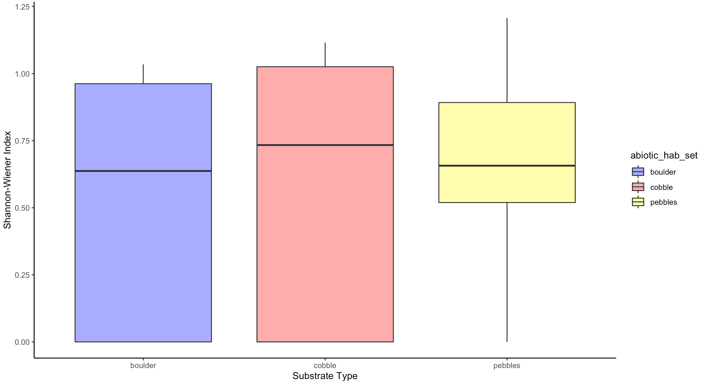
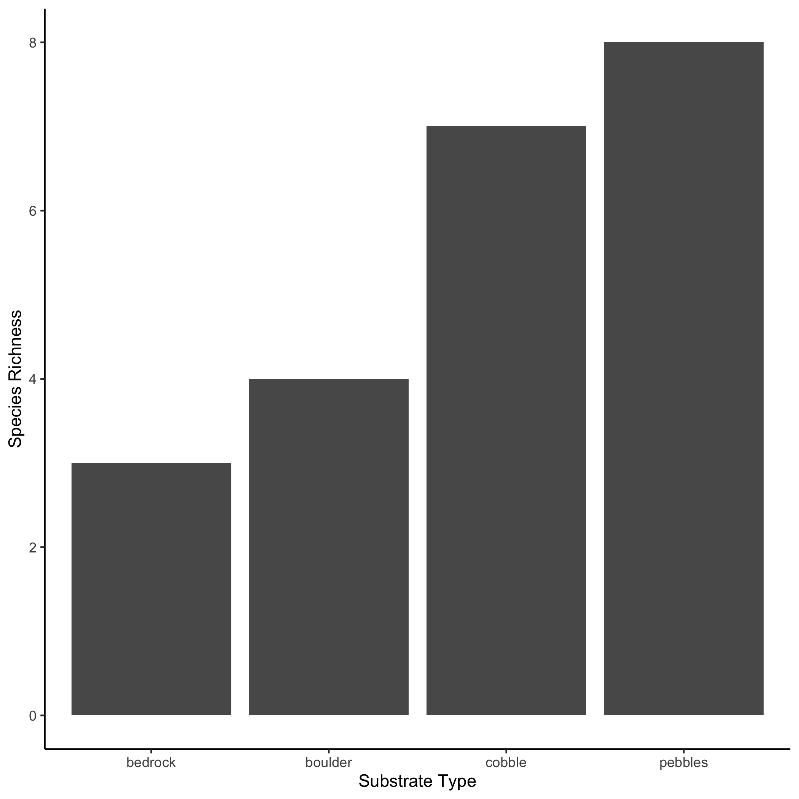
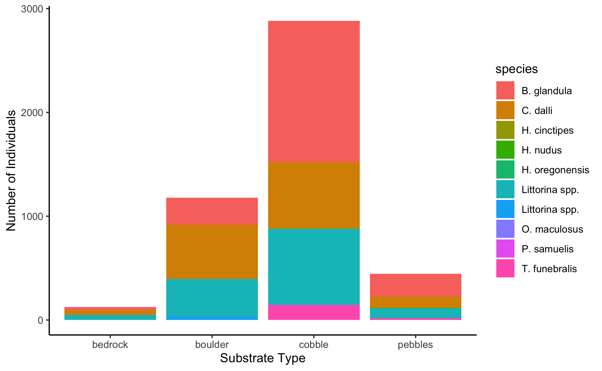

```{r}
library(tidyverse)
```


##Summary

In order to assess how different intertidal substrate affects biodiversity, sampling was conducted at Scotts Bay on October 25, 2021. Along a transect line, we used half-meter quadrats (10x10 squares) to assess biodiversity. We randomly selected 10 sub-samples within each quadrat and counted the number of each species we saw, the number of individuals within each species and which substrate (sand, pebbles, cobble, boulder or bedrock) these species were settled on. Based on the intermediate disturbance hypothesis, we expected to see the highest biodiversity on medium sized substrates. Using the Shannon-Wiener index, we assessed quadrat level biodiversity on each substrate type (Fig. 1). In addition, we found the species richness of each substrate type (Fig. 2), and finally we summed together the total number of individuals within each species found on the varying substrate types across all quadrats (Fig 3). Although we found a higher number of individuals on the medium sized sediment (boulder and cobbles) we found no significant difference ($p-value =0.752$) in Shannon-wiener biodiversity between substrates using an ANOVA test. 

```{r}
library(knitr)

```

Fig 1: Shannon-Wiener index comparing quadrat level biodiversity with respect to substrate type. We excluded sand and bedrock as sand did not have any organism while bedrock only had one species. No significant difference was found between pebbles, cobbles and boulder.

```{r}

```

Fig 2: Representative of the overall species richness between different substrate types on all quadrats.

```{r}

```

Fig 3: Total number of individuals per substrate type separated by species over all quadrats.


Table 1: Shannon-Wiener Index values for substrate types. 

| | Bedrock | Boulder | Cobble | Pebbles |
|------|------|------|------|------|
| H | 1.080693 | 1.056021 | 1.210030 | 0.728715 | 

