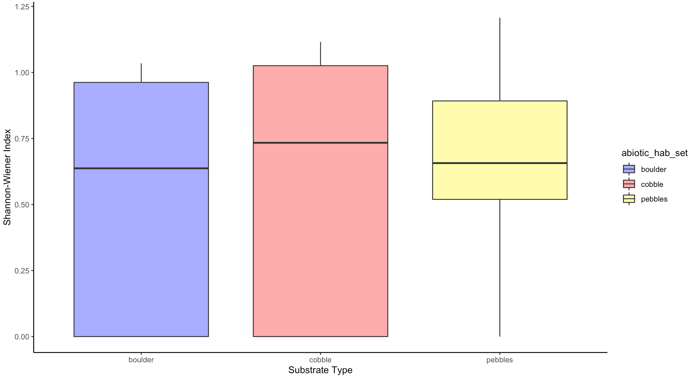
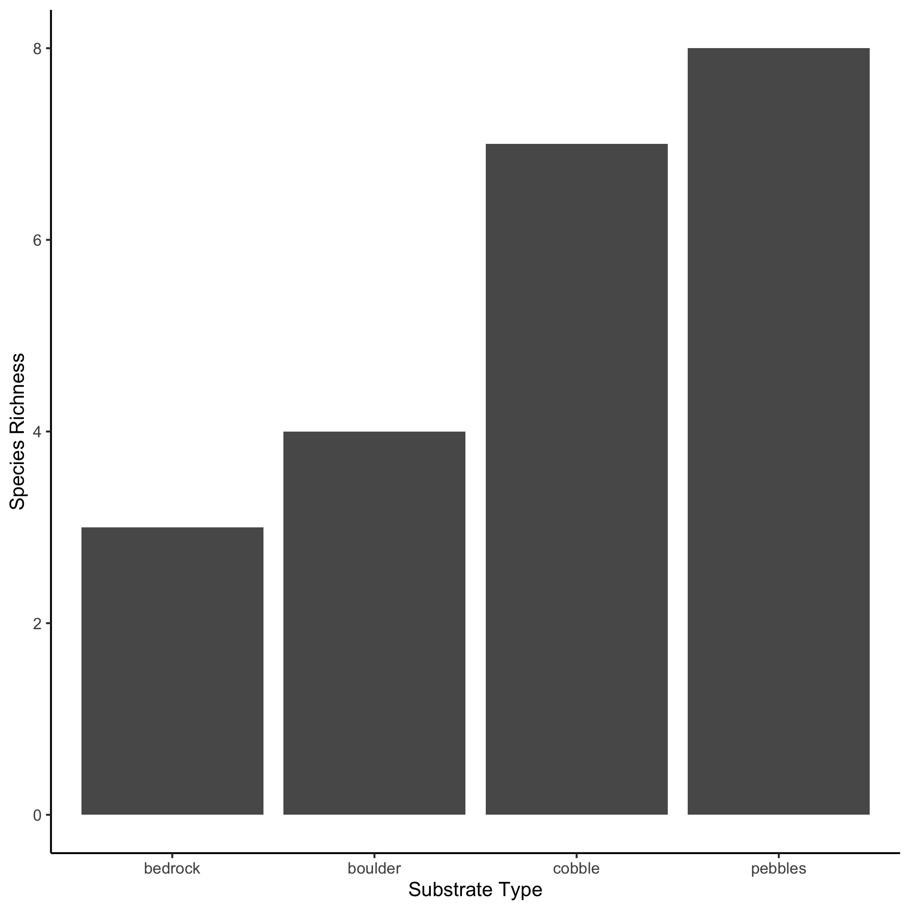

```{r}
library(tidyverse)
```

## Summary

In order to assess how beach substrate affects biodiversity, sampling was conducted at Scotts Bay on October 25, 2021. Along a transect line, we used half-meter quadrats (10x10) to assess the biodiversity. We randomly selected 10 sub-samples within each quadrat and counted the number of each species we saw, the number of individuals within each species and which substrate these species were settled on. Based on the intermediate disturbance hypothesis, we expect to see the highest biodiversity on medium sized substrates. Using the Shannon-Wiener index, we assessed quadrat level biodiversity on each substrate type (**Fig. 1**). We found no significant difference ($p-value =0.752$) in biodiversity between substrates using an ANOVA test. In addition, we found the species richness of each substrate type (**Fig. 2**), then we summed together the total number of individuals within each species found on the varying substrate types across all quadrats (**Fig 3**). In conclusion, the intermediate disturbance hypothesis may still be at play, however our sample size was too small to represent the whole picture. In order to obtain more representative results of the relationship between biodiversity and substrate type, we would need to expand our sample size and collect more data.

```{r}
library(knitr)

```

Fig 1: Shannon-Wiener index comparing quadrat level biodiversity with respect to substrate type. We excluded sand and bedrock as sand did not have any organism while bedrock only had one species. No significant difference was found between pebbles, cobbles and boulder.

```{r}

```

Fig 2: Representative of the overall species richness between different substrate types on all quadrats.

```{r}
knitr::include_graphics("images/stackedbarplot.png")
```

Fig 3: Total number of individuals per substrate type separated by species over all quadrats.

|     | Boulder  | Cobble   |
|-----|----------|----------|
| H   | 1.056021 | 1.210030 |
